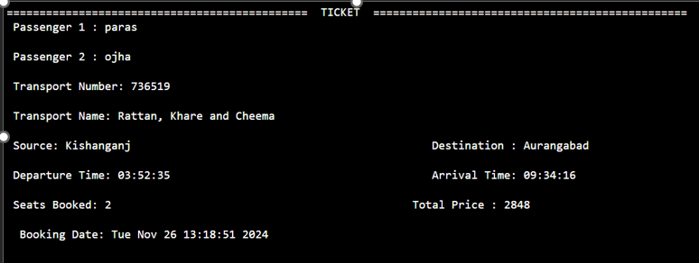

# Transportation Ticket Reservation System

## Project Overview

This Transportation Ticket Reservation System is a robust C++ application designed to provide an efficient and scalable solution for managing transportation ticket bookings. The project leverages advanced data structures and efficient algorithmic techniques to ensure optimal performance and user experience.

## Key Features

- Comprehensive ticket reservation and management
- Multiple transportation mode support
- Advanced data structure implementation
- Efficient search and retrieval mechanisms
- Secure and scalable architecture

## Data Structures Utilized

### 1. Linked List Implementation

- Used for dynamic passenger management
- Supports efficient insertion and deletion operations
- Enables flexible route and booking tracking

### 2. Vector Utilization

- Dynamic array for storing route information
- Provides flexible and efficient route management
- Supports automatic memory allocation and resizing

### 3. Unordered Map Integration

- Rapid ticket lookup and management
- O(1) average-case complexity for ticket searches
- Supports unique ticket ID mappings

## Traversal Techniques

### Linked List Traversal Methods

1. **Forward Traversal**

   - Standard linear traversal
   - O(n) complexity
   - Ideal for complete list processing

### Searching Strategies

- Binary search for sorted collections
- Hash-based lookups for unordered maps
- Linear search with optimization techniques

## System Architecture

### Modules

1. Ticket Reservation Module
2. Passenger Management
3. Route Configuration
4. Payment Processing
5. Reporting and Analytics

## Performance Optimization

- Implemented cache mechanisms
- Efficient memory management
- Minimized computational complexity
- Optimized data structure selection

## Future Enhancements

- Machine learning-based seat recommendation
- Real-time seat availability tracking
- Enhanced analytics dashboard
- Mobile application integration

## Contributing

1. Fork the repository
2. Create your feature branch
3. Commit your changes
4. Push to the branch
5. Create a Pull Request

## Output

## License

MIT License - See [LICENSE.md](LICENSE.md) for details

## Contact

Project Maintainer: [Vishwas]
Email: [srivastavavishwas01@gmail.com]
GitHub: [Vishwas-0642]
